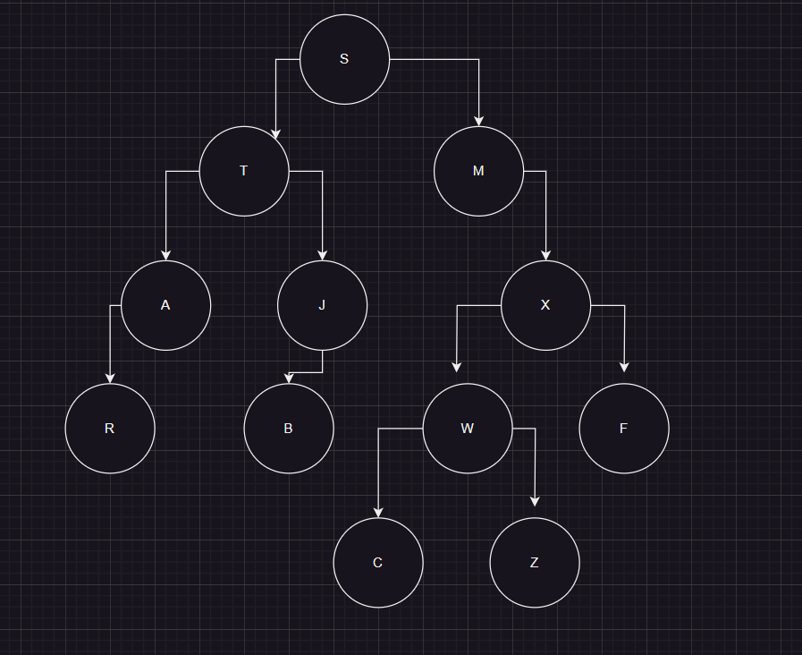

Ejercicio 2
--

Si los siguientes son los recorridos en inorden y postorden de un árbol binario, dibuje el árbol
que dio origen a esos recorridos.

Inorden: R,A,T,B,J,S,M,C,W,Z,X,F
Postorden: R,A,B,J,T,C,Z,W,F,X,M,S

En el árbol resultante:
* Parte 1: Respuesta
* Parte 2: Respuesta correcta 4
* Parte 3: Respuesta correcta 1

